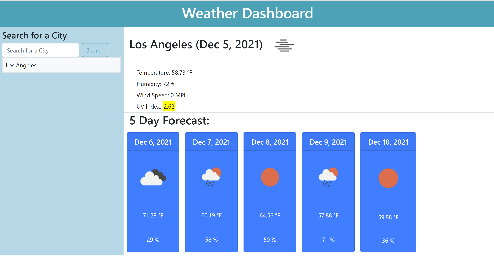

# Server-Side APIs: Weather Dashboard
A simple weather dashboard to look up the current weather and future 5 day forecast for a city

## Mission

My mission on this assignment was to create a simple weather dashboard using third-party API requests with specific parameters to a URL. My challenge was to build a weather dashboard that will run in the browser and feature dynamically updated HTML and CSS. 

## Utlized Support
* HTML
* CSS
* JavaScript
* jQuery
* Bootstrap
* Moment.js

## Process

Without fail, I was graciously led by my instructor, TA, tutor and my classmates. After the burnout from a recent group project, working on this homework was challenging- however, I am thankful to my classmates who study with me also guide me in bettering my code. 

My process started with fetching, then calling them to the html, and then to displaying them without the endless bugs that fuel my nightmares.

## Finished!

I give special thanks again to my classmates who continuously are there for coding and emotional support when the assignments almost have me down for the count.
Toiling through the endless debugging, I have a working weather dashboard. (When will I ever get used to these bugs?)

## Have a Look See

## [See It For Yourself Here](https://jlee3883.github.io/Weather-Dashboard/) ❤️️
